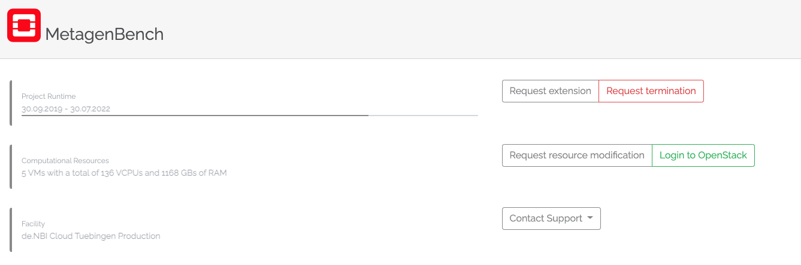
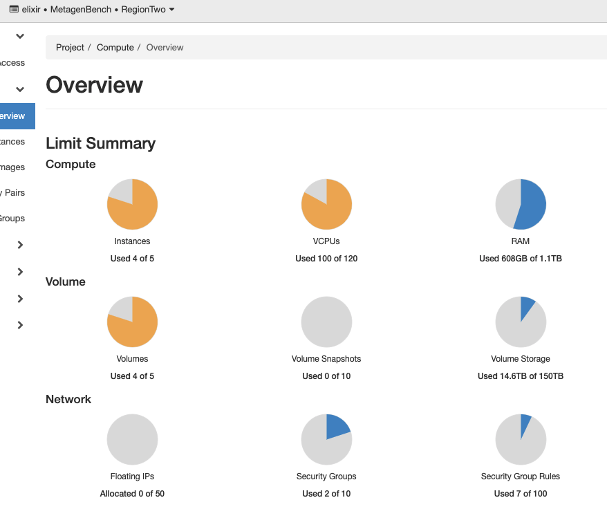
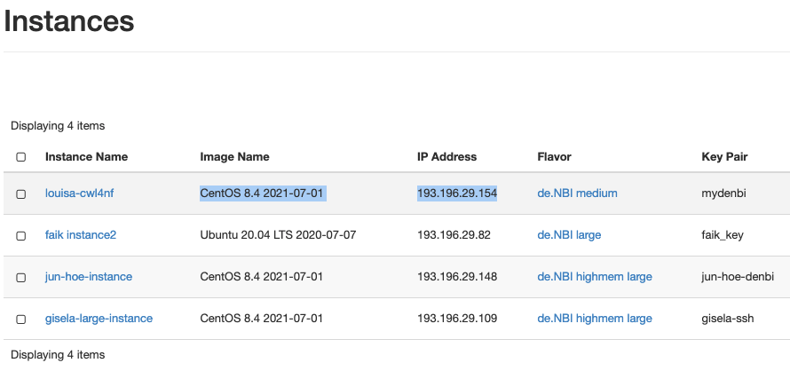

# Running jobs on denbi cloud

## Access to a project

Either request a new project to [deNBI cloud](https://cloud.denbi.de), or ask the RDDS team or team leader if you can create an instance in one of their projects. The info on how to apply for a new project is collected on the [deNBI wiki](https://cloud.denbi.de/wiki/portal/allocation/). We recommend you to apply for an `OpenStack Project` so you can configure your own settings and instances.

You should register with your University account to obtain an ELIXIR ID that will allow you to log into deNBI cloud, and once you have an account there, you can be added to an existing project. The instructions on how to register are found [here](https://cloud.denbi.de/wiki/registration/).

> Important! After registering it is necessary to send an email to the Tübingen cloud administrator, so that they activate your account.

## deNBI official documentation

The documentation on how to create instances and other important things is collected on the [deNBI Tübingen page](https://cloud.denbi.de/wiki/Compute_Center/Tuebingen). This documentation is not perfect, though, and I found it useful to add a few more notes here.

## Creating an instance

1. Log into `cloud.denbi.de`, select your project, and log into the OpenStack web interface by clicking the green button `Log into Openstack`.

    

2. You should then see the project overview board. This overview shows how many instances, and total CPUs, memory (GB), and Storage (GB) is still available for this project. If this is not enough for your needs, you can ask for access to another project or create a new project.

    

3. To create a new instance, go to the left menu: Compute -> Instances -> Launch Instance button. This will prompt a step by step guide:
    * Details: add an Instance Name
    * Source: select either "Image" for a generic image e.g. CentOS operating system, or "Instance Snapshot" for creating an Instance from a previous snapshot. For running `Nextflow` workflows, you can use the Instance Snapshot `nextflow-singularity` which already has `java-jdk12`, `Nextflow`, `Singularity` and `Docker` installed (check if Nextflow should be updated with `nextflow self-update`).
    * Flavour: select the instance flavour (number of CPUs and RAM).
    * Networks: select `denbi_uni_tuebingen_external` network.
    * Network Ports: leave empty.
    * Security Groups: add `default` AND `external_access`.
    * Key Pair: add a new key pair or select yours. Only one Key Pair is allowed per instance and if you lose the private key you will not be able to access the instance any more! If you choose to create a new keypair, make sure to copy the private key that is displayed to your computer, and store it under the `~/.ssh/` directory. You will also need to adapt the rights of this file so that only you (the computer main user) can read this file. You can do that in the command line by:

        ```bash
        chmod 600 <your_private_ssh_key>
        ```

    * Rest of fields: leave default.
    * Press on `create instance`

You should now see your image being Spawn on the **Instance dashboard**. It might take several minutes to spawn, especially if created from an Instance Snapshot. In this dashboard you will be able to see the instance IP and the operating system, which you will need to log into the instance via `SSH`.



## SSH to an instance

To ssh to an instance, you need the private key of the Key Pair that was used to create the instance, and the instance IP address.

```bash
ssh -i /path/to/private/ssh-key <username>@<IP>
```

The username is the name of the operating system that was used in the image. For the `nextflow-singularity` instance snapshot, it is `centos`. For an Ubuntu-based instance, that will be `ubuntu`.

```bash
ssh -i /path/to/private/ssh-key centos@<IP>
```

For regular fast-access to your instance it might be useful to create a SSH client configuration file. The default location for the configuration is `~/.ssh/config`.

```bash
Host <name>
    Hostname <IP>
    User <username>
    IdentityFile /path/to/private/ssh-key
```

To access your instance or copy files to/from your instance:

```bash
ssh <name>

# remote file transfer
scp local_files_to_copy <name>:/path_to_remote_folder
```

## Attach and mount volumes

In order to use an external cinder volume, you need to first create one on the OpenStack interface. Give the volume name and the amount of storage that you need (cannot exceed the total allowed for the project) and create a new empty volume (no image).

* Attach volume: on the volumes dashboard, under Actions for your volume click the arrow and select `manage attachments`. Attach the volume to your running instance.
* Mount volume: Follow the [instructions](https://cloud.denbi.de/wiki/Compute_Center/Tuebingen/#using-cinder-volumes) to mount the attached volume to your instance. Use `sudo` if you get any `permission denied` or `only root can do that` messages. Also you might need to recursively `chown` and `chgrp` the newly created folders to your user and group.

## Setting-up nextflow, singularity, docker

If you haven't created an instance based on an Image that already has java, Nextflow and singularity or docker installed (e.g. the `nextflow-singularity` image), you will need to install this software.

* Installation instructions for [Java](https://phoenixnap.com/kb/install-java-on-centos) on CentOS. For Nextflow you will need Java jdk <= 11.
* Instructions for installing Nextflow can be found [here](https://www.nextflow.io/docs/latest/getstarted.html)
* On CentOS, singularity can be installed with the package manager `yum`. First install the [dependencies](https://sylabs.io/guides/3.0/user-guide/installation.html#before-you-begin) and then head straight to the [CentOS section](https://sylabs.io/guides/3.0/user-guide/installation.html#install-the-centos-rhel-package-using-yum)
* For installing docker, please follow the [instructions](https://docs.docker.com/engine/install/centos/) and the [post-installation steps](https://docs.docker.com/engine/install/linux-postinstall/)

## Running Nextflow pipelines on deNBI

Running Nextflow pipelines on deNBI VMs is like running them locally on your computer. When launching a pipeline, make sure to define the maximum resources available at your instance, either with the appropriate parameters or with a custom config file (e.g. in a file called `custom.config`):

```console
params {
  max_memory = 512.GB
  max_cpus = 28
  max_time = 960.h
}
```

Then run the pipeline with the `singularity` or `docker` profile, whatever container system you prefer and have installed in the instance, and by providing this config file. The best is to start the run inside a screen session. For example:

```bash
screen -S newscreen
nextflow pull nf-core/rnaseq -r 3.4
nextflow run nf-core/rnaseq -r 3.4 -profile singularity,test -c custom.config
```
