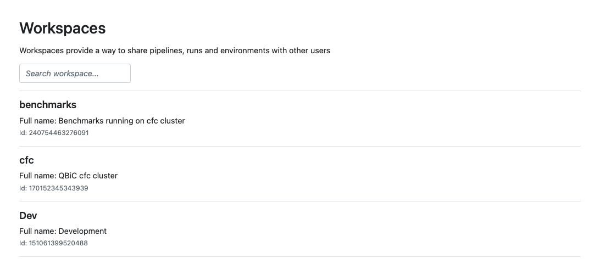
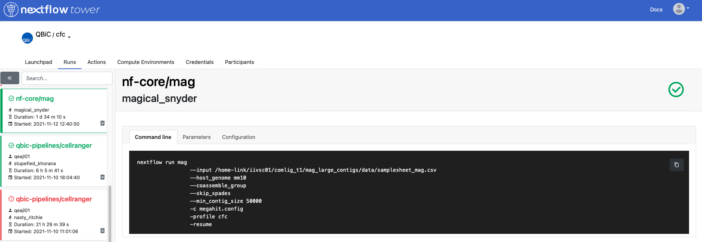
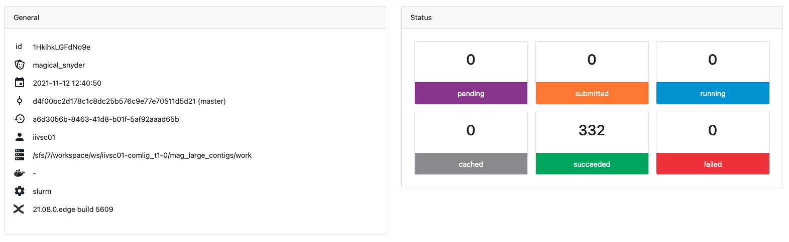
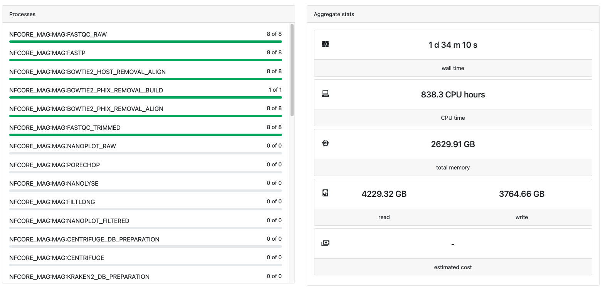

# Nextflow tower

Nextflow tower allows you to follow the Nextflow workflow runs on cfc and other compute infrastructure.
We have a local installation at QBiC which can be accessed [http://cfgateway1.zdv.uni-tuebingen.de/api](http://cfgateway1.zdv.uni-tuebingen.de/api).
To be able to follow the Nextflow workflow runs via tower, you can add Tower access credentials in your Nextflow configuration file (`~/.nextflow/config`) using the following snippet:

```console
tower {
  accessToken = '<YOUR TOKEN>'
  workspaceId = '<YOUR WORKSPACE ID>'
  endpoint = 'https://cfgateway1.zdv.uni-tuebingen.de/api'
  enabled = true
}
```

Your access token can be created on [this page](http://cfgateway1.zdv.uni-tuebingen.de/tokens).

The workspace ID can be found on the organisation's Workspaces overview page. [Here](http://cfgateway1.zdv.uni-tuebingen.de/orgs/QBiC/workspaces) you can find QBiC's workspaces:



To submit a pipeline to a different Workspace using the Nextflow command line tool, you can provide the workspace ID as an environment variable. For example

```console
export TOWER_WORKSPACE_ID=000000000000000
```

If you are outside of the University, access to the tower is only possible via [VPN](https://uni-tuebingen.de/en/facilities/zentrum-fuer-datenverarbeitung/services/network-services/network-access/remote-access-vpn/). When you started your run, you can now track its progress on the [Runs tab](http://cfgateway1.zdv.uni-tuebingen.de) after selecting your workspace and your run. Here is an example of what it looks like:




You can select your run on the left. You will see the name of the run, your command line and the progress and stats of the run.

For more info on how to use tower please refer to the [Tower docs](https://help.tower.nf/).
